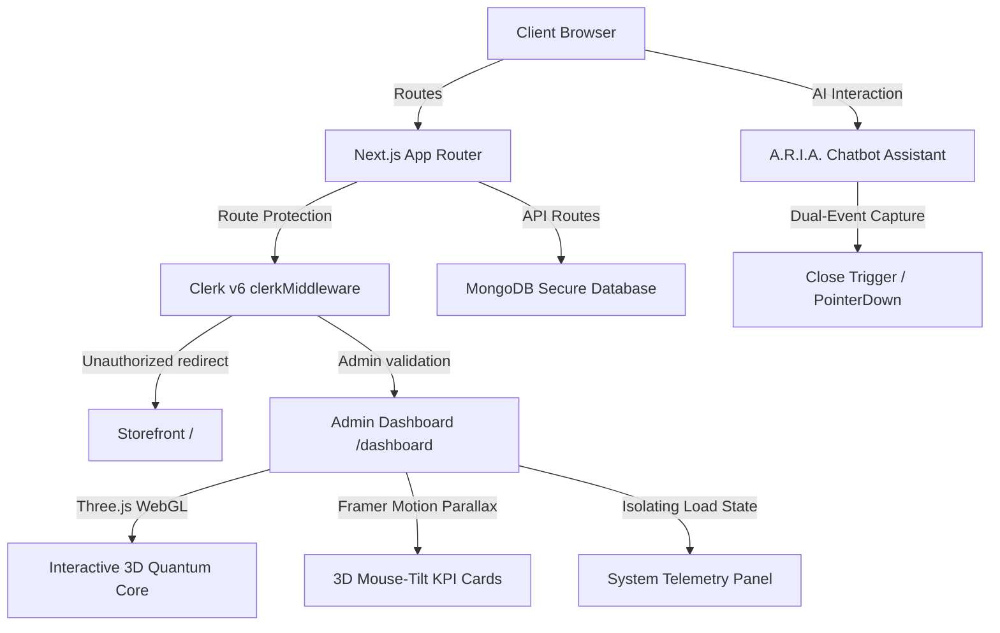

# 3DTechStore — Immersive 3D Hardware E-Commerce & Admin Control Deck

A futuristic, high-fidelity e-commerce and administrative dashboard platform built with **Next.js 15 (App Router)**, **React 19**, **Three.js / React Three Fiber**, **Framer Motion**, and **Clerk v6**. 

This system merges premium e-commerce storefront interactions (dynamic cart drawers, interactive showcases, AI support) with an immersive, WebGL-powered telemetry command deck for administrators.

---

## 📐 Systems Architecture



---

## 🛠️ High-Performance Technology Stack

* **Core Framework**: Next.js 15.4 (App Router) + React 19 + ES6 Javascript
* **WebGL & 3D Interactive Graphics**: `@react-three/fiber`, `@react-three/drei`, `three`
* **Animations & Micro-interactions**: `framer-motion`, `gsap`
* **Authentication & Role Gateways**: `@clerk/nextjs` (v6.28)
* **Styling & Aesthetics**: TailwindCSS v4 + Vanilla CSS Modules + Glassmorphic Design tokens
* **Analytics Visualization**: `recharts` + custom glowing SVG filters
* **Database Management**: `mongoose` + MongoDB Atlas schemas + SVIX Clerk Webhooks

---

## 📖 Operational Setup & Local Run

### 1. Prerequisites
Ensure you have Node.js version **18.0.0 or higher** installed.

### 2. Environment Configurations
Create a `.env.local` file in the root folder and supply your credentials:
```env
NEXT_PUBLIC_CLERK_PUBLISHABLE_KEY=your_clerk_pub_key
CLERK_SECRET_KEY=your_clerk_secret_key
MONGODB_URI=your_mongodb_connection_string
CLERK_WEBHOOK_SECRET=your_clerk_webhook_secret
```

### 3. Installation
Wipe any corrupted compiler caches and install dependencies:
```bash
# Clean lock files if required
npm install
```

### 4. Running the Stable Dev Compiler
Next.js 15 Turbopack has concurrent write locking issues on Windows platforms. We configure standard Webpack to build stable dev caches:
```bash
npm run dev
```
Open **`http://localhost:3000`** in your browser to view the storefront, or **`http://localhost:3000/dashboard`** to explore the console.

---

## 🎓 Software Engineering Interview Guide: Key Technical Complexities

If asked by an interviewer to explain **"What was the most challenging and complex part of building this project?"**, here is a structured, engineering-grade response detailing the design decisions and architectural challenges:

### 🚀 1. State Isolation for Render Optimization (O(N) ➔ O(1))
* **The Challenge**: The sidebar footer displays a live system load telemetry panel (`CYBER SYNC STATUS`) that updates every 3 seconds with active core statistics. In the initial layout, this state lived inside the parent `DashboardSlideBar` component, causing the **entire navigation sidebar to re-render every 3 seconds**. This triggered input latency if an administrator clicked navigation links during a telemetry sync cycle.
* **The Engineering Solution**: Isolated the telemetry tracking state into a decoupled leaf component, `<SystemLoadTelemetry />`. State changes are now encapsulated inside this small component tree, reducing parent re-renders to **zero** during navigation and ensuring instant route transition updates.

### 🛰️ 2. Clerk v6 Middleware & API Migration
* **The Challenge**: Clerk v6 completely deprecated the legacy `authMiddleware` hook, causing runtime compiler crashes on Next.js 15 server runtimes. We needed to protect complex nested dashboard routes (`/dashboard/*`) while allowing public routes (`/login`, `/register`, `/api/auth/clerk-webhook`) to remain accessible.
* **The Engineering Solution**: Refactored the core middleware to the modern asynchronous `clerkMiddleware` paradigm using `createRouteMatcher` route masks. Leveraged server-side dynamic imports of `@clerk/nextjs/server` (`clerkClient`) inside the middleware cycle to query user emails and perform secure, custom role validations on-demand without slowing down page routing.

### 🎡 3. Volumetric Parallax Vector Space with Framer Motion Springs
* **The Challenge**: Creating premium interactive elements required implementing smooth, non-linear 3D card tilt transformations that match the exact cursor coordinates of the user.
* **The Engineering Solution**: Tracked mouse positions (`clientX`/`clientY`) relative to the cards' viewport bounding rectangles (`getBoundingClientRect`). Translated these vectors into proportional rotation angles (`rotateX` and `rotateY`). Used Framer Motion spring physics configurations (`stiffness: 150`, `damping: 25`) to animate the rotation matrix smoothly, resulting in a volumetric hover effect that feels extremely responsive.

### 🎨 4. WebGL Geodesic Wireframe Integration
* **The Challenge**: Standard 3D web applications suffer from slow initial load times because they rely on downloading heavy external 3D model files (like `.glb` or `.gltf`).
* **The Engineering Solution**: Created an offline-compatible, lightweight **3D Quantum Core WebGL Canvas** using `@react-three/fiber`. Built a procedural geodesic wireframe sphere that generates mathematical vertices dynamically at runtime. This completely eliminated initial network download penalties, enabling a lightweight 3D experience that loads instantly.

### 💬 5. Stacking Context & Staggered Pointer Events (Chat Close Bug)
* **The Challenge**: The floating AI assistant's close button (`X`) was not responding to click events in certain browsers. The button was being intercepted by other DOM layers because of the complex z-index stacking context of Next.js parent containers.
* **The Engineering Solution**: Elevated the parent chat panel to a high stacking context (`z-[190]`). Standardized event capture by wrapping the click triggers in **both** `onClick` and `onMouseDown` hooks, and injected `e.stopPropagation()` and `e.preventDefault()`. This captured the user's action immediately on touch or press down and prevented parent containers from swallowing the event.
